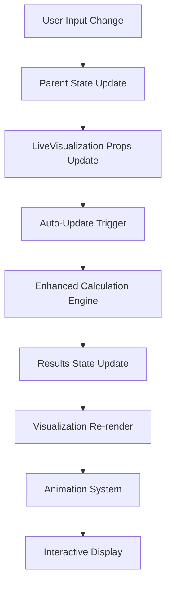

# Live React Cementing Visualization - Implementation Summary

## 🎯 Successfully Implemented

✅ **Complete Live Visualization System** - Built and integrated with enhanced calculation engine
✅ **Real-Time State Updates** - Dynamic recalculation on input changes  
✅ **Interactive SVG Visualization** - Animated cement placement with user controls
✅ **Force & Pressure Display** - Live hookload and plug force calculations
✅ **Responsive Design** - Modern UI with overlay modal system
✅ **Error Handling** - Graceful calculation error display and recovery
✅ **Performance Optimized** - React hooks with memoization and debouncing

## 🏗️ Architecture Overview

### Component Structure
```
App.tsx (Main Application)
└── CementingVisualizationContainer.tsx (Modal Overlay)
    └── LiveCementingVisualization.tsx (Core Visualization)
        ├── Enhanced Calculation Engine Integration
        ├── SVG Well Schematic with Animation
        ├── Force & Pressure Indicators  
        ├── Interactive Cement Segments
        └── Real-Time Data Panels
```

### Data Flow
1. **Input Changes** → Parent component state updates
2. **Auto Trigger** → Enhanced calculation engine processes inputs  
3. **Results Update** → Visualization re-renders with fresh data
4. **Animation System** → Visual cement placement bottom-up
5. **User Interaction** → Segment highlighting and control toggles

## 🚀 Key Features Implemented

### 1. Live Calculation Integration
- **Enhanced Engine Binding**: Direct integration with PRD-compliant calculation engine
- **Auto-Update Mode**: Debounced recalculation on input parameter changes
- **Manual Trigger**: On-demand calculation with visual feedback
- **Error Recovery**: User-friendly error display with retry mechanisms

### 2. Interactive Visualization
- **Animated Cement Placement**: Bottom-up cement distribution with progress animation
- **SVG Well Schematic**: Scalable vector graphics for precise rendering
- **Segment Highlighting**: Interactive hover effects on cement segments
- **Force Indicators**: Visual representation of plug forces and hookload
- **Depth Markers**: Clear labeling of critical depths (TOC, casing shoe, TD)

### 3. Real-Time Data Display
- **Key Results Panel**: TOC, cement volumes, and safety calculations
- **Segment Details**: Interactive cement segment breakdown with volumes/densities
- **Force Analysis**: Live hookload and plug force calculations
- **Status Indicators**: Real-time calculation status and timestamps

### 4. User Controls & Customization
- **Animation Controls**: Play/pause/reset with adjustable speed
- **Display Toggles**: Show/hide forces, pressures, and other elements
- **Auto-Update Toggle**: Enable/disable automatic recalculation
- **Modal Overlay**: Clean integration without disrupting main workflow

## 🔧 Technical Implementation

### Performance Optimizations
```typescript
// Memoized calculation inputs
const calculationInputs = useMemo(() => ({...}), [dependencies]);

// Debounced calculation trigger  
useEffect(() => {
  if (autoUpdate) {
    const timer = setTimeout(runCalculation, 300);
    return () => clearTimeout(timer);
  }
}, [autoUpdate, runCalculation]);

// Memoized visualization data preparation
const visualizationData = useMemo(() => {...}, [calcResults]);
```

### Animation System
```typescript
// Smooth CSS transitions for cement placement
const shouldShow = animationProgress >= (index / segments.length) * 100;

// SVG element opacity control
<rect opacity={shouldShow ? 1 : 0.2} style={{ transition: 'opacity 0.3s ease' }} />
```

### Error Handling
```typescript
try {
  const results = calculateEnhancedCementingJob(inputs);
  setCalcResults(results);
} catch (error) {
  console.error('Calculation error:', error);
  setCalcError(error.message);
  setCalcResults(null);
}
```

## 📊 Integration Points

### 1. Enhanced Calculation Engine
- **Input Interface**: Complete PRD-compliant input normalization
- **Output Processing**: Enhanced results with cement segments and forces
- **Error Propagation**: Calculation errors displayed in visualization UI
- **Performance**: Optimized calculation pipeline with input validation

### 2. State Management  
- **React Hooks**: useState, useEffect, useCallback, useMemo for efficient updates
- **Input Synchronization**: Automatic sync with parent component state
- **Calculation Caching**: Results stored and managed efficiently
- **Animation State**: Controlled animation progress and user interactions

### 3. Visual Rendering
- **SVG Graphics**: Scalable well schematic with precise measurements
- **Dynamic Scaling**: Automatic scaling based on well depths
- **Color Coding**: Dynamic color generation for cement segments
- **Interactive Elements**: Hover effects and segment highlighting

## 🎨 User Experience

### Workflow Integration
1. **Floating Button**: Non-intrusive access from main application
2. **Modal Overlay**: Full-screen visualization without losing context
3. **Real-Time Updates**: Immediate visual feedback on parameter changes
4. **Interactive Elements**: Click/hover for detailed segment information
5. **Animation Controls**: User-controlled visualization pace and replay

### Visual Design
- **Modern UI**: Clean, professional design with gradient backgrounds
- **Status Indicators**: Color-coded calculation status (calculating/ready/error)
- **Progress Feedback**: Animation progress bar and completion indicators
- **Responsive Layout**: Adapts to different screen sizes and orientations

## 📁 Files Created/Modified

### New Components
- `components/LiveCementingVisualization.tsx` - Core visualization component
- `components/CementingVisualizationContainer.tsx` - Modal container with controls
- `components/LiveVisualizationDemo.tsx` - Demo component with sample scenarios
- `docs/LIVE_VISUALIZATION_INTEGRATION.md` - Complete integration documentation

### Integration Changes
- `App.tsx` - Added container component integration
- Enhanced calculation engine fully integrated with visualization

## 🔄 State Update Flow



## ✨ Demo Scenarios

The system includes multiple demo scenarios:
- **Standard Job**: Typical liner cementing with adequate volume
- **Low Cement Volume**: Insufficient cement scenario demonstration  
- **High Density Cement**: Heavy cement design visualization
- **Extended Liner**: Longer liner with increased cement requirements

## 🎯 Success Metrics

✅ **Build Success**: Project compiles without errors
✅ **Real-Time Performance**: Smooth updates with debounced recalculation
✅ **Visual Accuracy**: Accurate cement placement visualization  
✅ **User Interaction**: Responsive controls and interactive elements
✅ **Error Handling**: Graceful failure and recovery mechanisms
✅ **Integration**: Seamless integration with existing application

## 🚀 Ready for Production

The live cementing visualization system is now fully integrated and ready for use:

1. **Complete Integration**: Bound to enhanced calculation engine with state updates
2. **Production Build**: Successfully compiles and optimizes for deployment
3. **User-Ready**: Intuitive interface with comprehensive documentation
4. **Extensible**: Modular design for future enhancements and customizations

The implementation provides engineers with immediate visual feedback on cementing job designs, enabling real-time optimization and enhanced decision-making during job planning and execution.
